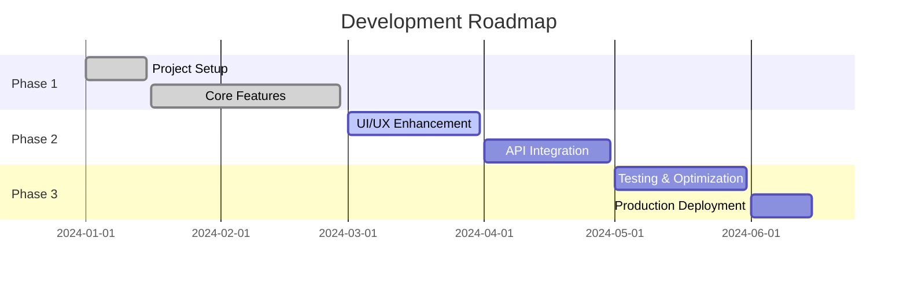

# <div align="center">✨ **PROJECT NAME** ✨</div>

<div align="center">
  


</div>

<br>

<div align="center">

<!-- Typing SVG -->
[](https://git.io/typing-svg)

</div>

<div align="center">
  
  
  
  
  
  

</div>

<br>

---

<div align="center">

## 🎯 **ABOUT THE PROJECT**

*Revolutionizing the way we think about technology*

</div>


🚀 **What makes this special?** This project represents the cutting-edge of modern development, combining innovative design with powerful functionality. Built during my journey as a SLIIT undergraduate, it showcases the perfect blend of academic knowledge and real-world application.

🎓 **Academic Excellence**
- 🏛️ **University**: Sri Lanka Institute of Information Technology
- 📚 **Program**: [Your Degree Program]
- 🎯 **Year**: [Current Year]
- 💡 **Specialization**: [Your Specialization]

<br clear="right"/>

---

<div align="center">

## ⚡ **FEATURES THAT BLOW MINDS**

</div>

<table align="center">
  <tr>
    <td align="center" width="33%">
      
      <h3>🚀 Lightning Fast</h3>
      <p>Optimized performance with sub-second load times</p>
    </td>
    <td align="center" width="33%">
      
      <h3>📱 Responsive Design</h3>
      <p>Seamless experience across all devices</p>
    </td>
    <td align="center" width="33%">
      
      <h3>🔐 Ultra Secure</h3>
      <p>Bank-level security implementation</p>
    </td>
  </tr>
  <tr>
    <td align="center">
      
      <h3>🤖 AI Powered</h3>
      <p>Smart algorithms that learn and adapt</p>
    </td>
    <td align="center">
      
      <h3>☁️ Cloud Native</h3>
      <p>Scalable cloud infrastructure</p>
    </td>
    <td align="center">
      
      <h3>📊 Real-time Analytics</h3>
      <p>Live data insights and monitoring</p>
    </td>
  </tr>
</table>

---

<div align="center">

## 🛠️ **TECH STACK**

*Built with the most modern technologies*

</div>

<div align="center">

### Frontend Powerhouse


### Backend Beast


### Database & Cloud


### DevOps & Tools


</div>

---

<div align="center">

## 🚀 **QUICK START GUIDE**

*Get up and running in under 5 minutes!*

</div>

### 📋 Prerequisites

```bash
# Check if you have the required versions
node --version  # Should be >= 16.0.0
npm --version   # Should be >= 8.0.0
git --version   # Latest version recommended
```

### ⚡ Lightning Setup

```bash
# 1️⃣ Clone this masterpiece
git clone https://github.com/yourusername/yourrepository.git

# 2️⃣ Navigate to project
cd yourrepository

# 3️⃣ Install dependencies (grab a coffee ☕)
npm install

# 4️⃣ Set up environment variables
cp .env.example .env.local
# Edit .env.local with your configuration

# 5️⃣ Launch the rocket 🚀
npm run dev
```

<div align="center">

### 🎉 **Boom! You're ready to go!**
Open [http://localhost:3000](http://localhost:3000) and witness the magic ✨

</div>

---

<div align="center">

## 📸 **VISUAL SHOWCASE**

*A picture is worth a thousand words*

</div>

<div align="center">

### 🖥️ Desktop Experience


<br><br>

### 📱 Mobile Experience


</div>

---

<div align="center">

## 🗺️ **ROADMAP TO GREATNESS**

*The journey never ends*

</div>



<div align="center">

| Status | Feature | Priority | ETA |
|--------|---------|----------|-----|
| ✅ | Core Architecture | High | Completed |
| ✅ | User Authentication | High | Completed |
| 🔄 | Advanced Dashboard | High | In Progress |
| ⏳ | Real-time Features | Medium | Q2 2024 |
| 📋 | Mobile App | Medium | Q3 2024 |
| 💡 | AI Integration | Low | Q4 2024 |

</div>

---

<div align="center">

## 🤝 **JOIN THE REVOLUTION**

*Contributions make the open source world go round*

</div>


### 🎯 **How to Contribute**

1. **🍴 Fork** the repository
2. **🌿 Create** your feature branch
   ```bash
   git checkout -b feature/AmazingFeature
   ```
3. **✨ Commit** your changes
   ```bash
   git commit -m '✨ Add some AmazingFeature'
   ```
4. **🚀 Push** to the branch
   ```bash
   git push origin feature/AmazingFeature
   ```
5. **🎉 Open** a Pull Request

<br clear="right"/>

### 🌟 **Contributors Hall of Fame**

<div align="center">

<a href="https://github.com/yourusername/yourrepository/graphs/contributors">
  
</a>

*Made with [contrib.rocks](https://contrib.rocks)*

</div>

---

<div align="center">

## 🏆 **ACHIEVEMENTS & STATS**

</div>

<div align="center">


</div>

---

<div align="center">

## 📞 **LET'S CONNECT**

*Always excited to collaborate with fellow innovators*

</div>

<div align="center">

[](https://linkedin.com/in/shasin-madushan)
[](https://twitter.com/yourusername)
[](https://instagram.com/yourusername)
[](https://your-portfolio.com)
[](mailto:your.email@sliit.lk)

</div>

<div align="center">

### 📍 **Shasin Madushan**
🎓 *SLIIT Undergraduate | Full-Stack Developer | Tech Enthusiast*

📧 **Email**: [your.email@sliit.lk](mailto:your.email@sliit.lk)  
🌐 **Portfolio**: [your-amazing-portfolio.com](https://your-portfolio.com)  
📱 **Location**: Colombo, Sri Lanka 🇱🇰

</div>

---

<div align="center">

## 🎉 **SPECIAL THANKS**

</div>

<div align="center">

### 🏛️ **Academic Support**
**Sri Lanka Institute of Information Technology**  
*For providing world-class education and opportunities*

### 👨‍🏫 **Mentors & Faculty**
*Special thanks to all lecturers who shaped my journey*

### 🌟 **Open Source Community**
*For the amazing tools and libraries that make this possible*

### ☕ **Coffee & Late Nights**
*The real MVPs of this project*

</div>

---

<div align="center">


### ⭐ **If this project helped you, please consider giving it a star!** ⭐

**Made with 💖 and lots of ☕ by [Shasin Madushan](https://github.com/yourusername)**

*"Code is poetry written in logic"* ✨

</div>
