# Hi there! 👋 I'm Shasin Madushan

<div align="center">
  
</div>

## 🌟 About Me


- 🎓 **Undergraduate at SLIIT** (Sri Lanka Institute of Information Technology)
- 💻 **Full Stack Developer** passionate about creating innovative solutions
- 🌱 Currently diving deeper into **advanced web technologies**
- 🎯 **2025 Goal**: Contribute to more open-source projects
- ⚡ **Fun fact**: I love turning coffee into code! ☕→💻

<br clear="right"/>

## 🔥 GitHub Stats & Activity

<div align="center">
  
  
</div>

<div align="center">
  
</div>

## 💻 Tech Stack & Languages

<div align="center">

### 🚀 Programming Languages


### 🛠️ Tools & Technologies


</div>

## 📊 Language Usage Statistics

```text
Java         ████████████████████████████████████████  99.3%
PHP          ███████████████████████████████████       77.5%
CSS          ████████                                  16.1%
JavaScript   █                                          2.5%
```

<div align="center">
  
</div>

## 🏆 GitHub Achievements

<div align="center">
  
</div>

## 📈 Contribution Journey

<div align="center">
  
**2024**: 1 Contribution | **2025**: 9 Contributions (and counting!) 📈


</div>

## 🎯 Current Focus

```mermaid
graph TD
    A[🎓 Academic Projects] --> B[💻 Web Development]
    B --> C[📱 Mobile Apps]
    C --> D[🤖 AI/ML Exploration]
    D --> E[🌐 Open Source]
    E --> F[🚀 Career Growth]
```

<div align="center">



</div>

## 🤝 Let's Connect!

<div align="center">
  
[](https://linkedin.com/in/yourprofile)
[](mailto:your.email@example.com)
[](https://yourportfolio.com)

</div>

## 💡 Random Dev Quote

<div align="center">
  
</div>

## 🐍 Contribution Snake

<div align="center">
  
</div>

---

<div align="center">
  
  
  **"Code is like humor. When you have to explain it, it's bad."** - Cory House
  
   <em><b>I love connecting with different people</b> so if you want to say <b>hi, I'll be happy to meet you more!</b> 😊</em>
</div>
